# Week-1 Report: _Hot Potato_

The `HelloWorld.sol` is a contract that allows users to set and update a greeting message, transfer ownership, and sell ownership.
It has an owner and various functions that can only be executed by the owner.
The contract includes modifiers to ensure only the owner can perform certain actions.
The contract can also receive funds and check its balance.

You can interact with the contract by buying ownership, updating the greeting message, transferring ownership, and selling ownership.

Overall, the contract demonstrates how Solidity smart contracts can store and manage data and interact with the blockchain network.

