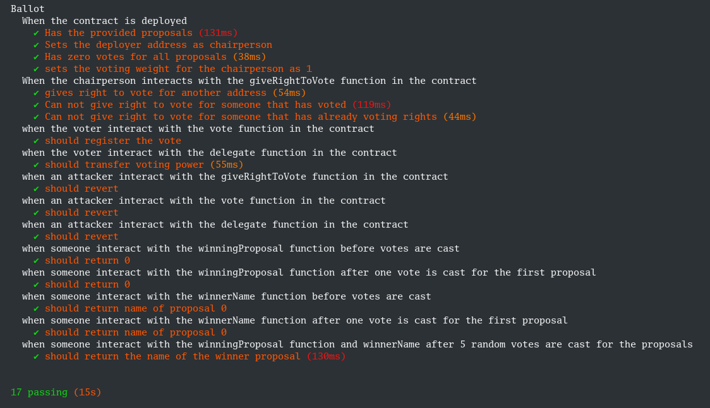
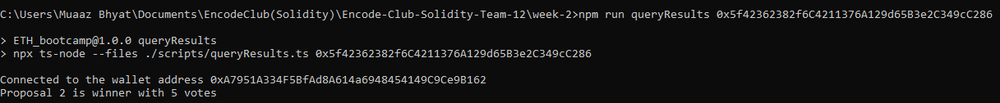
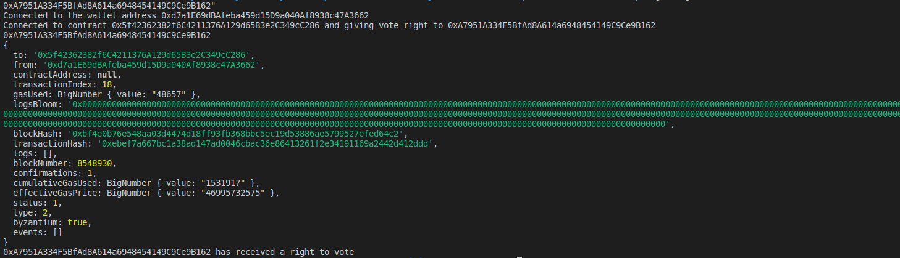
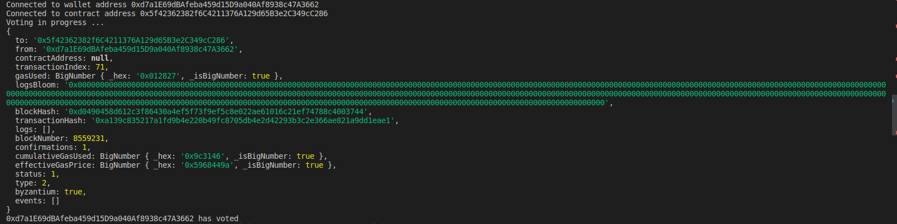

# Team 12 Week 2 Ballot Project

## Setup

This project uses npm to install dependencies. `npm install`

Wait for it to install, then use `npx hardhat compile`

It also requires you to have a local .env file placed into the source directory with the following format (this can also be found in the .env.example file)

```.env
MNEMONIC="here is where your twelve words mnemonic should be put my friend"
PRIVATE_KEY="<your private key here if you don't have a mnemonic seed>"
INFURA_API_KEY="********************************"
INFURA_API_SECRET="********************************"
ALCHEMY_API_KEY="********************************"
ETHERSCAN_API_KEY="********************************"
```
You must at minium add your private key and either your infura or alchemy API tokens

## Running scripts

### Hardhat test

```bash
npm run test
```

## Running scripts with arguments

### Deploying a contract with arguments

```bash
npm run deploy [proposals]
```
replace `[propsals]` with a list of proposals with a space between them

### Giving right to vote

```bash
npm run giveRight <contract-address> [addresses]
```
replace `[addresses]` with one or more addresses you would like to give the right to vote.

### Delegating vote

```bash
npm run delegate <contract-address> <address> 
```

### Casting vote

```bash
npm run castVote <contract-address> <Proposal>
```
replace `<Proposal>` with index of proposal to vote for.

### Querying results

```bash
npm run queryResults <contract-address>
```

## Report

### Testing

17 test conditions tested in `HRE`, before deploying contract to `goerli` net.



### Our Names and Addresses

Muaaz Bhyat - 0xA7951A334F5BfAd8A614a6948454149C9Ce9B162

Stefan Budai - 0xd7a1E69dBAfeba459d15D9a040Af8938c47A3662

Nauman Jabbar - 0xdc32853108f74eA7bFbCF7140605A3353b6532eA

Ahtisham Mehmood - 0x17d9bb657c98F9e6444735E05926F47B5B8332cE

Kaleb Dori - 0x109Bf5E11140772a1427162bb51e23c244d13b88

Eyassu Birru - 0x60BC23A55918bc761127bC2A7733455d273bac7C

Katya Ryazantseva - 0x4C2A233B9fA760ffDC12703242Fb3D0855334DFE

### Deployment  

[Ballot Contract](https://goerli.etherscan.io/address/0x5f42362382f6c4211376a129d65b3e2c349cc286) was deployed at address 0x5f42362382f6C4211376A129d65B3e2C349cC286 in this [transaction](https://goerli.etherscan.io/tx/0x9d4f94a0eefe42decda28e38d514497cb077edf7ca4eded7be0cf873c5e9c702) with three proposals, by Stefan

### Voting rights

[Gave Katya voting right](https://goerli.etherscan.io/tx/0x31375c95266b8995a485721325ca0af8bd24b14b70514b2c59e281f347037b4e)

[Gave Muaaz voting right](https://goerli.etherscan.io/tx/0xebef7a667bc1a38ad147ad0046cbac36e86413261f2e34191169a2442d412ddd)

[Gave Nauman voting right](https://goerli.etherscan.io/tx/0xc29467ac51ddb10de55795ea8ff6348ff3197cd861d16eb5c07929a0b157f2d4)

[Gave Ahtisham voting right](https://goerli.etherscan.io/tx/0x0cb337502d8a3d4ec67e5d34a41e426be3bc7a1859eb15c40f34a2cfdd2ecd37)

[Gave Kaleb voting right](https://goerli.etherscan.io/tx/0x05cd61ff9d6fc6fa84a6186cfb30cc672f9e1544f00dd4a7a3c28f82887df406)

[Gave Eyassu voting right](https://goerli.etherscan.io/tx/0x02d5e5b10960b935355fa691ce666d533ea2f7b62231faf1d3e8d450721ff8ff)

Stefan has implicit voting rights as contract deployer  

### Voting

[Nauman voted for proposal [^0]](https://goerli.etherscan.io/tx/0xdab9d18f3e4b4ddf5e3ba58af7dd77a5ca981972392d03b819ba8679e3442f5a)

[Katya voted for proposal [^1]](https://goerli.etherscan.io/tx/0x65d9734cf1ee5094e0a23e2e8c651f50b97b3688394ceca4aa2682dc6d8f8050)

[Stefan voted for proposal [^1]](https://goerli.etherscan.io/tx/0xa139c835217a1fd9b4e220b49fc8705db4e2d42293b3c2e366ae821a9dd1eae1)

[Kaleb voted for proposal [^1]](https://goerli.etherscan.io/tx/0x2a887a2e4eeba6d80c77c2fa808bb110454b60303c25c84c2f83435f5377ca4e)

[Eyassu voted for proposal [^0]](https://goerli.etherscan.io/tx/0x085db4973d5e1e3f2a1cd1fa6a7578f290b99791259dae6601e452f7072cbccb)

### Delegated Votes

[Muaaz delegated to Stefan](https://goerli.etherscan.io/tx/0xe057b228edc4e4c72048074d196216bc98bb87996c97fa91cdc5a5777ee15afa)

[Ahtisham delegated to Muaaz which delegated to Stefan](https://goerli.etherscan.io/tx/0xe057b228edc4e4c72048074d196216bc98bb87996c97fa91cdc5a5777ee15afa)

### Results

1. Before a vote is casted the result returns: `No vote has been casted yet`
2. When votes are tie the result is: `it's tie between # members. proposal x, proposal y with vote count of # `
3. When one proposal wins the result returns: `proposal x is winner with # votes`



### Gallery

Screenshot for giving right to vote.


Screenshot for casting vote.


### Indexing Proposals
[^0]: proposal[0] = Proposal 1
[^1]: proposal[1] = Proposal 2
